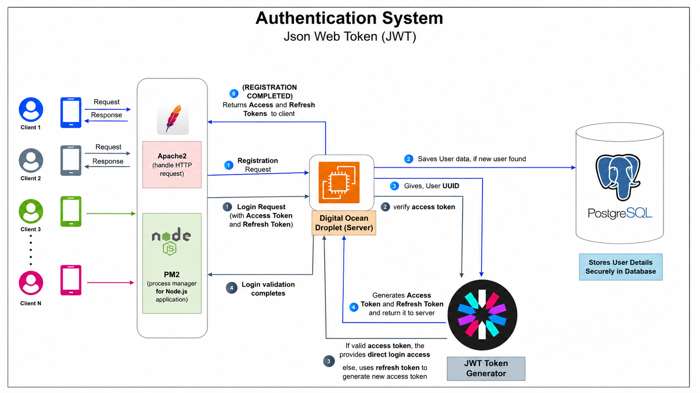
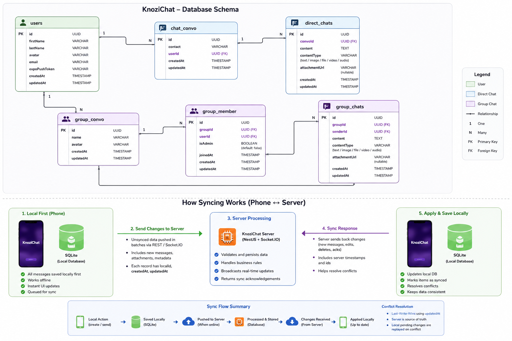
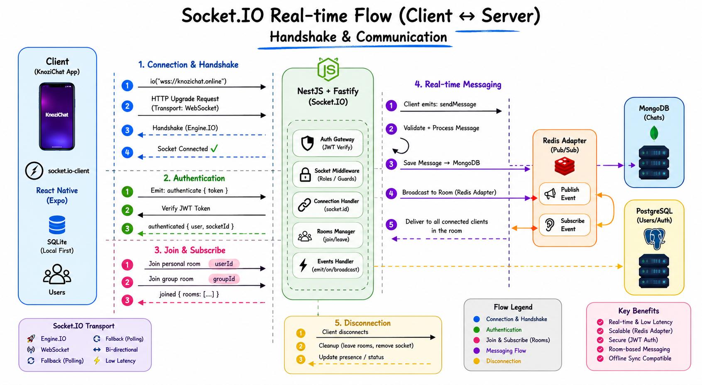
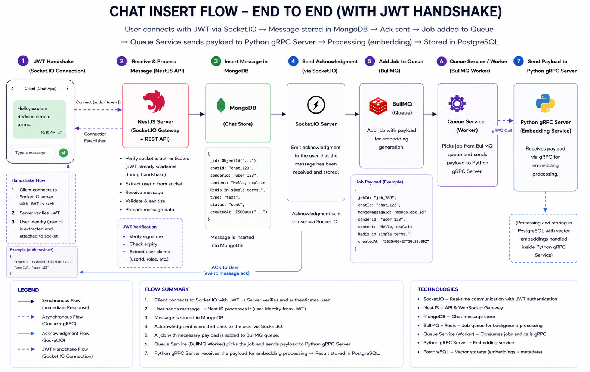
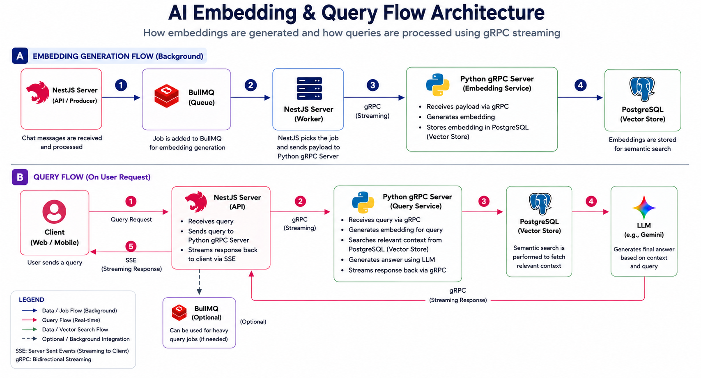

# KnoziChat-Backend

> Backend repository for KnoziChat, powering real-time one-to-one chats, group conversations, AI interactions, and device synchronization.

## Problem and Solution

**The Problem:** When users return to the app after a long period of inactivity, keeping track of what happened in the chat can be difficult. Scrolling through and reading every single missed message is a time-consuming and tedious process.

**The Solution:** KnoziChat integrates an AI-powered context engine built with a Python gRPC server and LangChain. This intelligent assistant helps users quickly catch up on missed discussions without needing to manually read through the entire chat history.

The AI system can:

- understand group context
- summarize conversations
- generate contextual replies
- maintain conversational awareness

---

KnoziChat is a scalable Android chat application built around:

- real-time communication
- local-first synchronization
- AI-powered conversations
- distributed backend systems
- event-driven architecture

This repository contains the backend services for the KnoziChat project.

## Frontend Repository

https://github.com/EzioAuditore12/KnoziChat

---

# Android APK

Download APK:

https://expo.dev/artifacts/eas/jD1GYnAXZ8PgSLRyHE3TST.apk

---

# Backend & API Services

KnoziChat is powered by:

- NestJS + Fastify backend
- Python gRPC AI server
- Socket.IO realtime infrastructure

## Backend Repository

https://github.com/EzioAuditore12/KnoziChat-Backend

---

# Hosted API Documentation

## NestJS Swagger Docs

https://knozichat.online/api

---

# Architecture Diagrams

## Authentication System



---

## Database Architecture & Synchronization Flow



---

## Socket.IO Handshake & Real-Time Communication



---

## Chat Insert Flow (End-to-End)



---

## AI Group Conversation System



### Flow Summary

1. User sends message via Socket.IO from the chat app.
2. NestJS Socket.IO Gateway receives the message, validates it, and prepares data.
3. Message is inserted into MongoDB (chat store).
4. Acknowledgment is emitted back to the user via Socket.IO.
5. A job with necessary payload is added to BullMQ queue.
6. Queue Service (BullMQ Worker) picks the job and sends payload to Python gRPC Server.
7. Python gRPC Server receives the payload for embedding processing and stores the result in PostgreSQL.

---

# System Overview

KnoziChat follows a hybrid polyglot persistence architecture designed for scalable real-time communication.

| Technology | Responsibility                        |
| ---------- | ------------------------------------- |
| PostgreSQL | User metadata and relational entities |
| MongoDB    | Chat and conversation persistence     |
| Redis      | Session caching and event propagation |
| SQLite     | Local-first mobile synchronization    |

---

# Database Architecture

The system separates concerns across multiple services and storage layers.

## Direct Conversations

Handles one-to-one communication with support for:

- text messages
- image sharing
- file attachments
- media synchronization

---

## Group Conversations

KnoziChat uses a dedicated membership architecture instead of storing participants directly inside groups.

This enables:

- scalable group management
- admin permissions
- membership tracking
- synchronization optimization

---

## Unified Message Architecture

Both:

- direct chats
- group chats

support:

- text
- images
- videos
- file attachments
- future media formats

through a unified content system.

---

# Offline-First Synchronization

KnoziChat uses a Local-First synchronization architecture powered by SQLite.

Messages are:

1. stored locally first
2. rendered instantly
3. synchronized asynchronously with backend services

This enables:

- low-latency communication
- offline messaging
- network recovery synchronization
- better user experience under unstable connectivity

---

# Synchronization Flow

## 1. Local Persistence

Messages are immediately written to SQLite before network synchronization occurs.

The UI updates instantly without waiting for backend acknowledgment.

---

## 2. Socket.IO Synchronization

The client emits synchronization events through Socket.IO.

The backend:

- validates authentication
- processes changes
- persists messages
- broadcasts updates to connected users

---

## 3. Real-Time Communication

Connected users receive:

- live messages
- typing indicators
- message seen updates
- synchronization events

through bidirectional WebSocket communication.

---

## 4. Reconnection Handling

When connectivity returns:

- pending local messages synchronize automatically
- remote updates are fetched incrementally
- SQLite cache is updated
- synchronization conflicts are resolved

---

## 5. Media Synchronization

Attachments are synchronized separately from text payloads to improve:

- bandwidth efficiency
- retry reliability
- synchronization stability

---

# Socket.IO Communication Flow

The communication layer uses:

- Engine.IO handshake
- JWT authentication
- Socket.IO rooms
- bidirectional event streams

Each:

- user
- direct conversation
- group

operates within isolated Socket.IO rooms for efficient event broadcasting.

---


# Redis Integration

Redis is used for:

- Socket session caching
- transient state management
- distributed event propagation
- conversational session persistence

---

# Tech Stack

## Frontend

- React Native
- Expo
- TypeScript
- NativeWind
- SQLite

## Backend

- NestJS
- Fastify
- Socket.IO
- Python gRPC
- LangChain

## Databases & Infrastructure

- PostgreSQL
- MongoDB
- Redis
- Docker
- PM2
- Apache2

---

# Installation

## Clone Frontend Repository

```bash id="t2n7z0"
git clone https://github.com/EzioAuditore12/KnoziChat
cd KnoziChat
```

---

## Install Dependencies

```bash id="e3gmk6"
pnpm install
```

---

## Start Expo Development Server

```bash id="e6wkgw"
pnpm start
```

---

## Clone Backend Repository

```bash id="i7f5vf"
git clone https://github.com/EzioAuditore12/KnoziChat-Backend
cd KnoziChat-Backend
```

---

## Install Backend Dependencies

```bash id="yz6u4r"
pnpm install
```

---

## Start Backend Server

```bash id="8yo3mp"
pnpm run start:dev
```

---

# Future Improvements

- [ ] Publish application to Google Play Store
- [ ] Push notification support
- [ ] Offline media synchronization
- [ ] Distributed WebSocket scaling
- [ ] Kafka-based event streaming
- [ ] Voice and video communication
- [ ] Advanced AI memory persistence

---

# Why KnoziChat?

KnoziChat was built to explore:

- Offline-first mobile systems
- Real-time distributed communication
- AI-assisted messaging
- Scalable backend infrastructure
- Event-driven architectures
- Polyglot persistence systems
